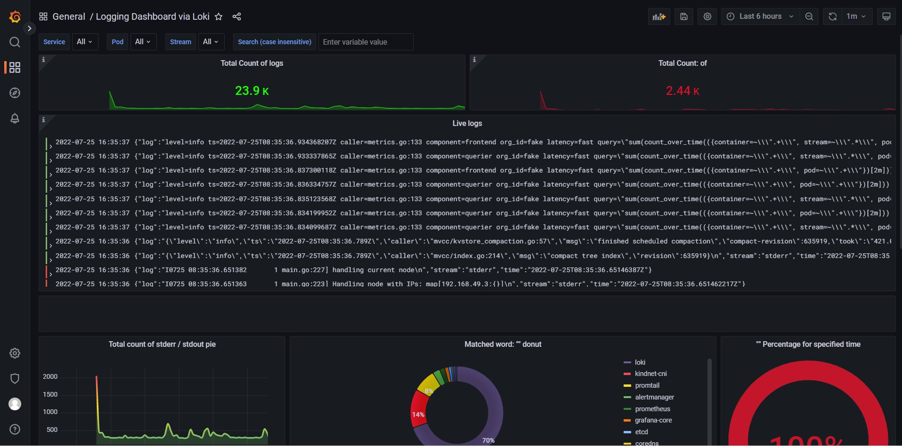
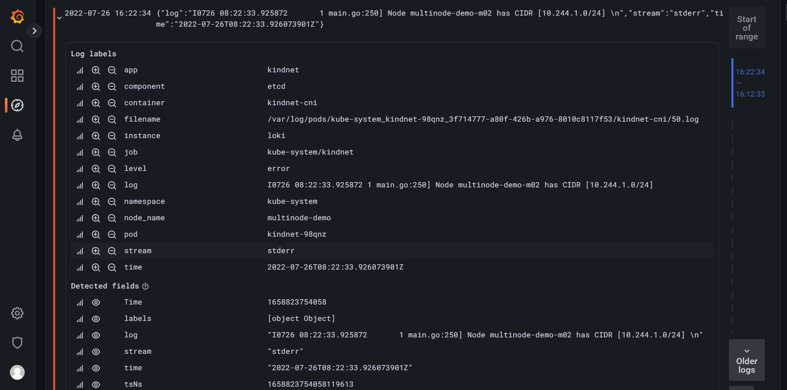

# 在Minikube上配置loki/promtail日志监控

- [准备工作](#准备工作)
- [配置Loki](#配置loki)
- [配置promtail](#配置promtail)
- [配置grafana](#配置grafana)
- [小结](#小结)
- [补充说明](#补充说明)
- [主要参考资料](#主要参考资料)
  

<br>  

## **准备工作**

### **配置minikube和grafana**   
在安装loki/promtail之前，我已经配置好了一个minikube集群，上面跑着grafana和prometheus相关的服务。配置minikube和grafana的过程在此不再赘述。还没有minikube/grafana的读者可自行查询相关资料。  


### **安装helm**
本文使用loki官方的helm chart安装，所以首先需要安装helm。我的minikube运行环境是基于WSL2/Ubuntu的，安装helm的命令如下：
```
$ curl https://baltocdn.com/helm/signing.asc | gpg --dearmor | sudo tee /usr/share/keyrings/helm.gpg > /dev/null
$ sudo apt-get install apt-transport-https --yes
$ echo "deb [arch=$(dpkg --print-architecture) signed-by=/usr/share/keyrings/helm.gpg] https://baltocdn.com/helm/stable/debian/ all main" | sudo tee /etc/apt/sources.list.d/helm-stable-debian.list
$ sudo apt-get update
$ sudo apt-get install helm
```
其它环境的安装方法请参考正文后面的参考资料。  
<br>  


### **配置helm chart仓库** 
安装好helm以后，接着配置grafana的helm chart仓库：  
```
$ helm repo add grafana https://grafana.github.io/helm-charts

$ helm repo update
```
<br>  

## **配置loki**

首先生成参数文件，用来定制我们需要调整的参数：
```
$ helm show values grafana/loki > loki-values.yaml
```
然后编辑生成的loki-values.yaml文件，进行必要的调整。修改的内容主要包括：

- 因为我是用于测试，不需要太大的存储空间，所以把存储容量设置为200MB。读者可以根据自己的需求自行调整。
```
persistence:
  enabled: false
  accessModes:
  - ReadWriteOnce
  # size: 10Gi
  size: 200Mi
```

- 设置CPU和内存资源的使用限制
```
resources: 
  limits:
    cpu: 200m
    memory: 256Mi
  requests:
    cpu: 100m
    memory: 128Mi
```

参数调整完成以后，创建loki的资源。注意这里一并创建namespace。
```
$ helm install loki grafana/loki -n loki --create-namespace -f loki-values.yaml
```

创建完成以后，查看pods和服务都已经正常启动：
```
$ kubectl get pods -n loki
NAME             READY   STATUS    RESTARTS        AGE
loki-0           1/1     Running   0               4h40m

$ kubectl get service -n loki
NAME              TYPE        CLUSTER-IP    EXTERNAL-IP   PORT(S)    AGE
loki              ClusterIP   10.98.111.8   <none>        3100/TCP   4d4h
loki-headless     ClusterIP   None          <none>        3100/TCP   4d4h
loki-memberlist   ClusterIP   None          <none>        7946/TCP   4d4h

```


## **配置promtail**

与loki类似，首先获取可配置的参数：
```
$ helm show values grafana/promtail > promtail-values.yaml
```
然后编辑生成的promtail-values.yaml文件，设置适合自己的参数。修改的内容主要包括：

- 设置资源的使用限制
```
resources: 
  limits:
    cpu: 200m
    memory: 128Mi
  requests:
    cpu: 100m
    memory: 128Mi
```

- 把client url改成http://loki:3100/loki/api/v1/push：  
```
config:
  clients:
    # - url: http://loki-gateway/loki/api/v1/push
    - url: http://loki:3100/loki/api/v1/push
```

参数调整完成以后，创建promtail资源：
```
$ helm install promtail grafana/promtail -n loki -f promtail-values.yaml
```


## **查看日志**
### **配置grafana**
- 登录进入grafana，配置一个loki的数据源，主要是设置名字和URL：


在上图显示的URL中，第一个loki表示服务名称，第二个loki是namespace的名称，svc表示是一个k8s服务。URL里的主机名必须是在k8s环境中能够正确解析的域名。

- 导入日志视图“Logging Dashboard via Loki”，视图ID是12611。由于原始视图中的配置和我的环境不一致，所以需要对视图中的查询做一些调整。我自己调整后导出的文件为[grafa-dashboard-logging-12611.json](./grafa-dashboard-logging-12611.json)

<br>  


### **查看日志视图**
打开视图，可以看到日志的信息：


<br>  

## **小结**
通过这个简单的测试，初步验证loki/promtail能够实现kebernetes环境的日志监控需求。loki安装配置比elasticsearch简单。根据其它资料提供的数据，loki的资源消耗也比elasticsearch要小。另外，promtail/loki/grafana的组合能够很好地和指标监控平台prometheus整合，使用同样的标签进行查询和统计，并统一在grafana上进行展示。

<br>  

## **补充说明**  

### **"too many outstanding queries"错误**
在初步配置完成以后，grafana在展示视图的时候出现大量的“too many outstanding queries”错误。通过修改loki-values.yaml文件，在config部分加入下列配置：
```
config:
  ...
  #============================================
  #  解决too many outstanding queries问题
  query_range:
    split_queries_by_interval: 0
    parallelise_shardable_queries: false
  querier:
    max_concurrent: 2048
  frontend:
    max_outstanding_per_tenant: 4096
    compress_responses: true
  #============================================
```

详细讨论可以参考：  
[Grafana dashboard shows "too many outstanding requests" after upgrade to v2.4.2
](https://github.com/grafana/loki/issues/5123)

<br>  

### **使用从日志中解析的字段进行查询**  

在使用grafana查询loki中的日志时，可以根据日志标签（log labels）和从日志中解析出来的字段（detected fields）进行查询。

  
在loki的文档中，这两种数据的都叫做标签，但是使用方式不同，容易造成困惑，所以这里记录一下。
log labels标签的使用比较直观，直接在日志选择器（stream selector）的大括号里指定标签的值，例如：  
```
# 选出grafana的日志
{container=~".+", app="grafana"}
```
而像stream这样从日志中解析出来的字段，则是跟在解析短语的后面。参考下面的例子：  
```
# 解析json格式的日志，筛选其中stream的值为“stderr”的日志
{container=~".+"} | json | stream="stderr"
```

关于查询可以参考我的另一篇文章： [LogQL - 从小白到入门](./intro-to-LogQL.md)

<br>  

## 主要参考资料  
- [Logging in Kubernetes with Loki and the PLG stack](https://www.thorsten-hans.com/logging-in-kubernetes-with-loki-and-plg-stack/#what-is-promtail)  
- [LPG（Loki+Promtail+Grafana） 日志收集系统实践和踩坑经历](http://t.csdn.cn/0NMbR)
- [安装helm](https://helm.sh/zh/docs/intro/install/)